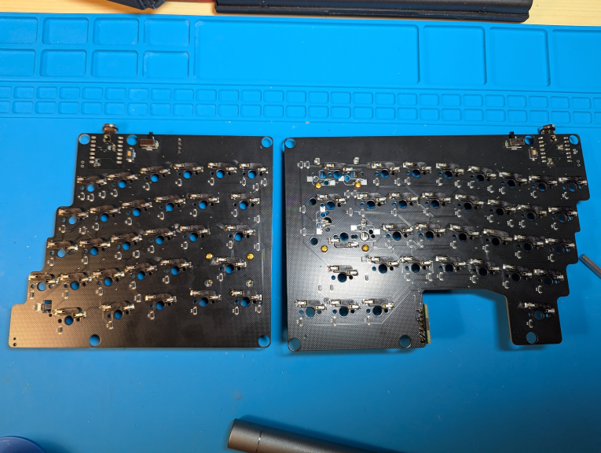
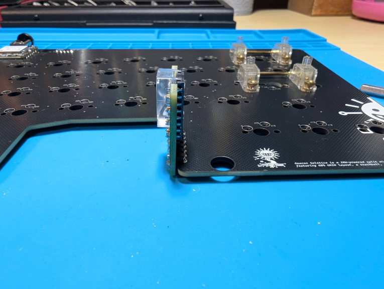
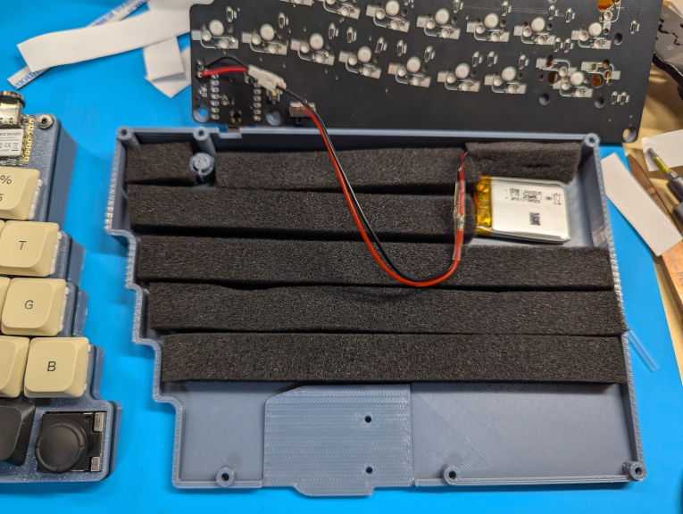
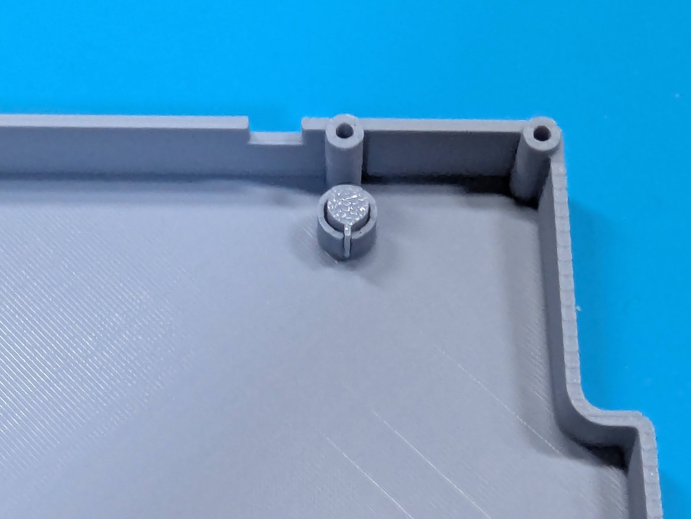

# 🌞 GeaconSolstice 🌛 ビルドガイド

## 🚀 はじめに
このビルドガイドではGeaconSolsticeの組み立て手順を説明します。組み立ては約1-2時間程度で完了します。

## 📋 目次
1. [部品の確認](#部品確認)
2. [組み立て手順](#組み立て手順)
3. [ファームウェアの書き込み](#ファームウェアの書き込み)
4. [キーボードの使い方](#キーボードの使い方)

## 📦 部品確認
### 📥 付属品
|名前|数|備考|
|:-|:-|:-|
|メインPCB（右）|x1| |
|メインPCB（左）|x1| |
|Seeed Studio XIAO nRF52840|x2|メインPCBに取付済み|
|PMW3610用PCB|x1|メインPCBに取付済み|
|L字ピンヘッダー|x1|メインPCBに取付済み|
|バッテリー用ケーブル|x2|※無線化する場合のみ必要|
|スイッチプレート（右）|x1| |
|スイッチプレート（左）|x1| |
|ケース（右）|x1| |
|ケース（左）|x1| |
|ガスケット（右）|x1|MXのみ必要|
|ガスケット（左）|x1|MXのみ必要|
|リセットスイッチボタン|x2| |
|トラックボールケース|x1| |
|2mmセラミックボール|x3|トラックボールケースに圧入済み|
|OLED|x1|メインPCBに取付済み|
|アナログスティック|x1||
|M3x5mmネジ|x2| |
|M3x6mmネジ|x10| |

### 🛒 別途用意するもの
|名前|数|備考|
|:-|:-|:-|
|34mmボール|x1| |
|Cherry MX/Choc V2キースイッチ|x63～64|JIS配列の場合x64|
|Cherry MXキーソケット|x63～64|JIS配列の場合x64|
|PCBマウントスタビライザー|x2～3|Cherry MXの場合のみ、JIS配列の場合x2|
|キーキャップ| | |
|3.7V電池（Lipoバッテリー502030想定）|x2|※無線化する場合のみ|
|両面テープ|x2| |

### 🛠️ 必要な工具
|工具名|用途|備考|
|:-|:-|:-|
|はんだごて|はんだ付け作業|温度調節機能付きを推奨|
|はんだ|各種実装|Pb含有はんだ 0.8mm程度|
|ニッパー|リード線カット用| |
|精密ドライバー|ネジ止め用|M2、M3用|
|ピンセット|部品の取り扱い用| |

## 🔧 組み立て手順

### ⚡ スイッチソケット、スタビライザーの実装
1. PCBの印刷された向きに注意してソケットを置く
2. ソケットをはんだ付けする
3. はんだ付けが確実にされているか確認する
4. スタビライザーを取り付ける  
  
  

### 📺 OLEDの実装
⚠️ **重要: ピンの向きを間違えると故障の原因となります**

1. OLEDモジュールのピン配列を確認
   - VCC
   - GND
   - SCL
   - SDA
2. PCB上の印字とピン配列を合わせて差し込む
3. 裏面からはんだ付けを行う
4. ピンの余分な部分をカット

### 🔋 バッテリーケーブルの実装
⚠️ **重要: 極性を間違えると故障の原因となります**

1. メイン基板を裏向きにする
2. バッテリーのパッドの極性を確認する
   - 上: +（VCC、赤）
   - 下: -（GND、黒）
3. ケーブルを差し込み、表からはんだ付けする
4. 余分なリード線をカットする
5. ケーブルをテープや接着剤でPCBに固定する（推奨） 

⚠️ **注意**: PCB実装時にケーブルを挟まないよう注意してください

### 🔌 バッテリーの実装
ケース左上の空間にバッテリーを両面テープなどで固定する。  
バッテリーケーブルとバッテリーを接続する。（赤線と赤線、黒線と黒線がつながるようにすること。）  

### 🕹️ アナログスティックの実装
1. FFCコネクタの爪を持ち上げて開放状態にする  
■閉じた状態  
  
■開いた状態  
  

2. アナログスティックのネジ穴の突起を切り取る  

3. FFCケーブルの向きに注意して、コネクタに差し込む  

4. FFCコネクタの爪を下げて閉じた状態にする  

5. アナログスティックの裏面に両面テープを張って基板に固定する

### ⌨️ スイッチプレートの組み立て
1. MXスイッチを使用する場合はガスケットとPCBとスイッチプレートの間に挟む  

2. スイッチプレートとメインPCBを重ねてスイッチを挿していく。  
⚠️ **注意**: スイッチの足が曲がらないように注意して挿入してください
⚠️ **注意**: スイッチプレートはプラスチック製のため傷がつきやすいため、取り外しの際はご注意ください

### 📦 ケースの組み立て
1. リセットスイッチをケース内側から差し込む。（吹き飛びやすいので注意）  

2. メインPCBをケースに取り付ける。この時、バッテリーケーブルがPCBのネジ穴とケースの固定用突起などに挟まれないように注意すること。  
3. M3ネジでPCBをケースに固定する。  

### 🔮 トラックボールケースの実装
トラックボールケースを差し込み、裏からM2ネジで固定する。  

## 💾 ファームウェアの書き込み
1. USBケーブルでPCに接続する。  
2. 裏面のリセットスイッチを素早く2回クリックするとUSBドライブとしてマウントされる。  
3. UF2ファイルをドラッグ＆ドロップするとファームウェアの書き込みが始まる。  
4. 完了すると自動的に切断され、使用できる状態となる。  

## 🌲 完成！
これで完成です。出来上がったキーボードの写真を各種SNSやビルドログとして投稿いただけると、私が泣いて喜びます。  
私の最高到達点としての、GeaconSolsticeをお楽しみください。

## 💫 キーボードの使い方

### 🎯 レイヤー機能の概要
|レイヤー番号|名称|機能概要|
|:-|:--|:--|
|0|USレイヤー|標準レイヤー|
|1|疑似JISレイヤー|🇯🇵日本語入力用レイヤー|
|2|Functionレイヤー|⚙️ファンクションキー|
|3|マウスレイヤー|🖱️トラックボール操作|
|4|スクロールレイヤー|📜スクロール操作|
|5|BTレイヤー|📶無線接続設定|

### 🇯🇵 JISレイヤー機能
- tabキー長押しでレイヤー1（疑似JISレイヤー）を有効/無効を切り替える。  
- レイヤー1は日本語配列として認識しているキーボードで英語配列の入力ができる。  
  （例：日本語配列として認識しているPCで、レイヤー1を有効にしてSHIFT+2→＠を入力） 

### 🖱️ マウスレイヤー機能
以下のマウス入力が可能となる。
|キー|機能|
|:-|:-|
|「.」キー|左クリック|
|「/」キー|中央クリック|
|「右SHIFT」キー|右クリック|

### 📶 接続プロファイル切り替え機能
- 「＼」キーを押している間レイヤー5が有効になり、同時に数字1~5を押すことで接続プロファイルを切り替える。  
- レイヤー5で「`」キー→現在の接続プロファイルを消去する。tabキー→接続プロファイルを全て消去する。  

## ℹ️ その他
### 🔌 電源スイッチ
電源スイッチは左側でON、右側でOFFとなる。